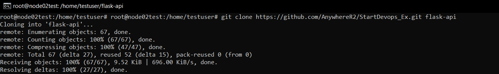

Как запустить проект локально:
1. Клонировать проект с GitHub -  git clone https://github.com/AnywhereR2/StartDevops_Ex.git flask-api

2. Перейти в папку flask-api и изменить название файла .env.example на .env
3. Поменять на свои значения данные в .env и удалить image_name из .env
4. Удалить строку image: ${IMAGE_NAME} из docker-compose.yaml
5. Запустить - sudo docker compose up -d
6. Приложение будет доступно по заранее заданному вам порту.

Как настроить Jenkins:
1. Установить Jenkins на сервере и проверить доступность по адресу: http://IP:8080/
2. В Jenkins установить следующие плагины:
workflow-aggregator
pipeline-stage-view
workflow-durable-task-step
workflow-multibranch
git
ssh-agent
docker-workflow
email-ext
credentials
credentials-binding

3. Корне проекта есть директория: jenkins
4. Необходимо создать папку и настроить в ней два pipeline. Название папки - Folder name: ExamWeb
5. Название pipeline: 01_CI и 02_CD
6. В корне Item - создать еще 1 pipeline который - объединяет в себе 01_CI и 02_CD. Название - Master_job
7. Настроить ключи и креденшелы в Jenkins:
ckerhub-creds
deployip
deploy-key
Secret file .env (envfile)

8. Запустить Master_job

Как работает CI/CD:

01_CI

Stage
Checkout - Клонирует репозиторий с GitHub
Build - Собирает Docker-образ
Lint - Проверяет качество Python-кода (flake8)
Push -  Публикует Docker-образ на DockerHub
Cleanup - Удаляет контейнер и файлы

02_CD

Install Docker & Compose -  Установка Docker и Docker Compose на удалённый сервер
Install Git -   Установка Git на удалённом сервере
Clone Git Repo - Clone GitHub
Upload .env -   Передача файла окружения .env
Run docker-compose - Запуск  контейнеров
Health Check - Проверка  на /ping

Master_job
Запуск pipeline 01_CI потом 02_CD

root@node02ans:~# curl http://serverip:port/ping
{"status":"ok"}

root@node02ans:~# curl -X POST http://serverip:port/submit -H "Content-Type: application/json" -d '{"name": "Anton", "score": 50}'
{"message": "Saved"}

root@node02ans:~# curl -X GET http://serverip:port/results
{
 "results": [
   {
     "id": 1,
     "name": "Anton",
     "score": 50,
     "timestamp": "2025-06-09 11:34:45.163402"
   }
 ]
}

Скриншоты Jenkins Pipeline:

